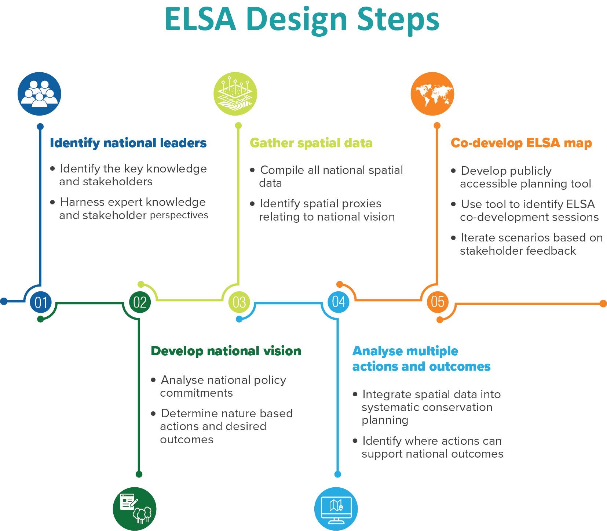

# ELSA tool - case study Ecuador

This repository details parts of the Essential Life Support Area (ELSA) framework outlined in Venter et al. (2024)[preprint link?]. In particular, this repository contains the code for the Shiny tool for conservation planning developed and employed in Step 4 and 5 of the ELSA framework (Fig. 1). The case study uses Ecuador as its planning domain, but the framework was co-developed and stress-tested through partnerships between the United Nations Development Programme (UNDP) and governments in 13 pilot countries: Cambodia, Chile, Colombia, Costa Rica, Dominican Republic, Ecuador, Haiti, Kazakhstan, Liberia, Nepal, Peru, South Africa, and Uganda.

{#id .class width="50%" align="center"}

## Background (**just copied abstract for now**)

Many nations are making increasingly bold commitments to halting biodiversity loss, minimising the impacts of climate change, and transitioning to sustainable economies. The effective achievement of these ambitions relies on integrated spatial planning frameworks that are adaptable to national circumstances. Here, we describe the development and application of an operational framework for national-level integrated spatial planning to identify areas that if protected, sustainably managed, or restored can maximize achievement of national commitments to biodiversity, climate, and sustainable development: Essential Life Support Areas (ELSAs). The process to map ELSAs relies heavily on national policy commitments, national stakeholder leadership, spatial data and systematic conservation planning tools. We showcase ELSA mapping in Ecuador, where the use of real-time scenario analyses enabled diverse stakeholder groups to collaborate together to rank national priorities, view trade-offs that result from conflicting priorities, thereby fostering dialogue and collaboration. Our findings demonstrate an actionable approach for nations to create spatial plans aimed at fulfilling their national and international commitments to nature. The ELSA process provides a foundation that can guide landscape planning and resource allocation as new national needs, priorities, and data emerge.

## Repository structure

This repository has all the code and data required to set up an ELSA Webtool for Ecuador. It therefore contains all the components typically needed to set up an R Shiny App:

-   A `ui.R` script that determines the user interface of the tool
-   A `server.R` script that contains the server function with the code for the spatial optimisation and other data analysis
-   A `start.R` script that allows to launch the app

Additionally, this repository contains a `R/` folder with helper functions for data loading, calculations, and visualisation that are primarily called in the `server.R` function, as well as a `pre_global.R` and a `global.R` script that help with setting up the app.

## Set up

There are several steps required before running this tool. We will first briefly describe the steps needed to employ this tool in one of the countries outlined above and then outline the steps required to run the Shiny application for the case study outlined here and in the manuscript by Venter et al. (2024).

### For applying the ELSA tool to a country of interest, the following are required:

**Note that only step 4 is required if you only want to run the app for the case study (skip steps 1-3).**

1.  An appropriate data stack for the planning region. All input data should be in `data/elsa_inputs/`.

2.  A `Master_ELSA_Database` file (for the Ecuador case study: `Ecuador_Master_ELSA_Database.xlsx`), which serves as a dictionary to match the required conservation planning inputs with their respective names in the input data folder, as well as some initial conditions and settings to set up a conservation planning problem.

3.  A `Translation matrix` file (here: `Translation matrix of the ELSA webtool.xlsx`), which allows to translate the tool into several different languages.

4.  A solver to solve the the conservation planning problem. There is a range of solvers available that differ in terms of performance and cost. For our analysis and the figures shown in Venter et al. (2024), we used the commercial [Gurobi software](https://www.gurobi.com/solutions/gurobi-optimizer/). To allow to run the ELSA tool without a Gurobi license, we recommend installing a free solver. We include the free [HiGHS](https://highs.dev/) software in the package requirements in the `start.R` script, so no additional installations from your side are required, but any solver supported by the [`prioritizr`](https://prioritizr.net/) R package can be used. Simply add the R package interfacing the solver of your choice to the list of required packages in the `start.R`script. **Note that your results might differ slightly from those shown in the manuscript depending on the solver used. Additionally, the input data is at a coarser resolution (2000m) to accommodate for using a slower (publicly available) solver.**

### After ensuring the data and software described above are all available and correctly installed, the following steps are required to run the ELSA tool:

**Note that step 2 is NOT required if you only want to run the app for the case study.**

1.  Set your working directory to the appropriate path were the tool is saved.

2.  Update the `pre_global.R` script

    1.  Navigate to `Pre_global.R settings` and adapt the country and language settings as needed
    2.  Ensure the data sheet file name is correct for your file in `Load Data Sheet`
    3.  Ensure the translation file is correct for your file in `Load Translation File`

3.  If not run previously, run pre_global.R

    1.  Set `weight_cal` to `TRUE` (**Note that this is not required when only running the case study, but you will still need to run pre_global.R**)

    2.  Set back to `FALSE` after completion

4.  Open the `start.R` script and run app, either by selecting Run App in the top right corner or by running all the code in this script.

## Navigating the ELSA Webtool - Ecuador

After launching the Shiny app, a browser window with the tool will open. The ELSA Webtool has three main components:

1.  A sidebar and one tab (`Edit weights`) that allows to **set the inputs** for the optimization based on user interests:

    -   The `Edit weights` tab allows the user to assign a higher importance to certain features. This is done in the ELSA pipeline together with stakeholders from the resprective countries. For more information on weighting, please refer to Venter et al. (2024).
    -   The ELSA tool finds solutions for conservation problems for three different spatial zones, a *Protect* zone, a *Restore* zone and a *Manage* zone (for more information on each zone, please refer to Venter et al. (2024)). In the side bar, users can set their preferred area-based budgets for the individual zones (in % of the total area of the region).
    -   In the sidebar, users can also set a boundary penalty that increases the level of spatial clumping of the solution, as well as decide whether they always want to include current protected areas in the *Protect* zone by locking them in.
    -   Lastly, input data in the ELSA Webtool are grouped into three themes (Biodiversity, Climate Change Mitigation, and Human Well-Being). The sidebar allows to run optimizations for each themes individually as well as for all of them combined.
    -   Once all desired inputs are selected , the user can click on `RUN OPTIMIZATION` to solve a conservation problems based on their inputs in real-time. This might take a while (\< 2 minutes without a boundary penalty) depending on the selected inputs.

2.  One tab that allows the user to **view the input data** (`Input Layers`)

    -   The `Input Layers` tab renders am interactive map showing the input data used for the optimization. Data can be explored by selecting different layers on the map icon in the top left of the tool.

3.  Two tabs that allow the user to **explore the results** (`Results + Downloads` and `Result Map`)

    -   The `Results + Downloads` tab shows a summary table of the optimization results as the representation of each feature in the ELSA map, overall and within each of the zones. This tab has the option to download the GIS layers, as well as the summary table.

    -   The `Result Map` tab renders an interactive ELSA map of the optimization results based on the selected inputs.
